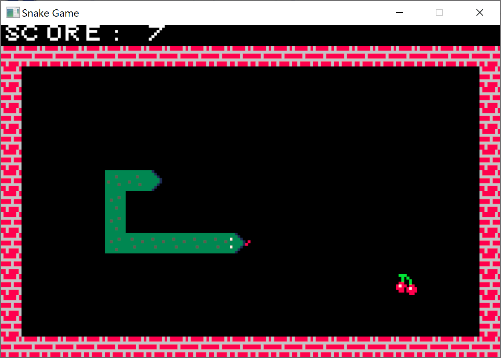
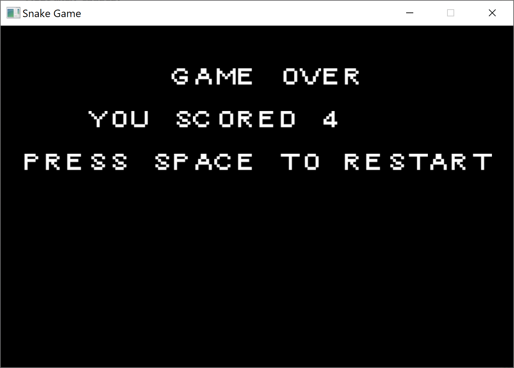

# snake_game

Classic game implemented in Rust. And this is a test.

## Controls

Use WASD or arrow keys to control the snake. Press `SPACE` when on game over screen to restart.

## Couple of screenshots

## Credits

Thanks to Cosme @ itch.io for the [assets](https://cosme.itch.io/snake).

## Implementation TODO-list

- [x] Draw the snake
- [x] Control the snake
- [x] Generate pickups and consume them
- [x] Draw the score
- [x] Implement the game-over screen
- [ ] Implement the high scores list (maybe)
